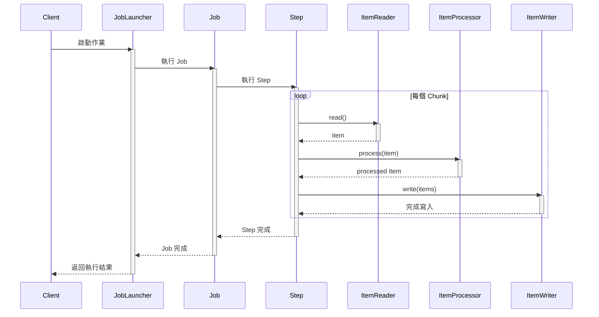
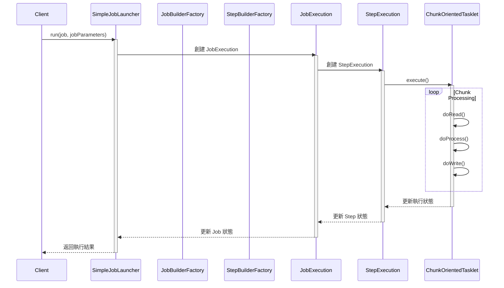

# Spring Batch 完整指南

## 目錄
1. [核心概念](#1-核心概念)
2. [架構組件](#2-架構組件)
3. [執行流程](#3-執行流程)
4. [配置詳解](#4-配置詳解)
5. [進階功能](#5-進階功能)
6. [最佳實踐](#6-最佳實踐)
7. [常見問題與解決方案](#7-常見問題與解決方案)
8. [效能優化指南](#8-效能優化指南)

## 1. 核心概念

### 1.1 什麼是 Spring Batch?
Spring Batch 是企業級批次處理框架，專為處理大規模數據操作而設計。主要特點：
- 可重啟性：支援作業中斷後重啟
- 跳過記錄：可設定錯誤處理策略
- 資源管理：自動管理數據庫連接等資源
- 事務處理：確保數據一致性

### 1.2 核心術語
- **Job Repository**: 儲存作業執行相關的元數據
- **Job Launcher**: 作業啟動器，負責作業執行
- **Job**: 批次處理的頂層單位
- **Step**: 作業中的獨立處理階段
- **Chunk**: 數據處理的基本單位
- **Item**: 處理的最小數據單元

## 2. 架構組件

### 2.1 Domain 物件
```java
// JobInstance：作業實例
public class JobInstance {
    private Long id;
    private String jobName;
    // 代表特定作業的唯一執行實例
}

// JobExecution：作業執行
public class JobExecution {
    private Long id;
    private JobInstance jobInstance;
    private BatchStatus status;
    private Date startTime;
    private Date endTime;
    // 記錄作業執行的狀態和結果
}

// StepExecution：步驟執行
public class StepExecution {
    private Long id;
    private StepInstance stepInstance;
    private int readCount;
    private int writeCount;
    private int commitCount;
    // 記錄步驟執行的詳細信息
}
```

### 2.2 主要介面
```java
// 讀取介面
public interface ItemReader<T> {
    T read() throws Exception;
}

// 處理介面
public interface ItemProcessor<I, O> {
    O process(I item) throws Exception;
}

// 寫入介面
public interface ItemWriter<T> {
    void write(List<? extends T> items) throws Exception;
}
```

## 3. 執行流程

### 3.1 邏輯流程圖


### 3.2 類執行流程圖


## 4. 配置詳解

### 4.1 基礎配置
```java
@Configuration
@EnableBatchProcessing
public class BatchConfig {
    @Autowired
    private JobBuilderFactory jobBuilderFactory;
    @Autowired
    private StepBuilderFactory stepBuilderFactory;
    
    @Bean
    public Job importUserJob(Step step1, Step step2) {
        return jobBuilderFactory.get("importUserJob")
            .incrementer(new RunIdIncrementer())
            .listener(new JobCompletionNotificationListener())
            .flow(step1)
            .next(step2)
            .end()
            .build();
    }
}
```

### 4.2 資料庫配置
```yaml
spring:
  batch:
    job:
      enabled: false  # 禁用自動執行
    initialize-schema: always
  datasource:
    url: jdbc:mysql://localhost:3306/batch
    username: root
    password: password
    driver-class-name: com.mysql.cj.jdbc.Driver
```

### 4.3 Step 配置
```java
@Bean
public Step step1() {
    return stepBuilderFactory.get("step1")
        .<Person, Person>chunk(10)
        .reader(reader())
        .processor(processor())
        .writer(writer())
        .faultTolerant()
        .skipLimit(3)
        .skip(Exception.class)
        .listener(new StepExecutionListener())
        .build();
}
```

## 5. 進階功能

### 5.1 並行處理
```java
@Bean
public Step parallelStep() {
    return stepBuilderFactory.get("parallelStep")
        .<Person, Person>chunk(10)
        .reader(reader())
        .processor(processor())
        .writer(writer())
        .taskExecutor(taskExecutor())
        .throttleLimit(4)
        .build();
}

@Bean
public TaskExecutor taskExecutor() {
    ThreadPoolTaskExecutor executor = new ThreadPoolTaskExecutor();
    executor.setCorePoolSize(4);
    executor.setMaxPoolSize(8);
    executor.setQueueCapacity(20);
    return executor;
}
```

### 5.2 重試機制
```java
@Bean
public Step retryableStep() {
    return stepBuilderFactory.get("retryableStep")
        .<Person, Person>chunk(10)
        .reader(reader())
        .processor(processor())
        .writer(writer())
        .faultTolerant()
        .retryLimit(3)
        .retry(DeadlockLoserDataAccessException.class)
        .build();
}
```

## 6. 最佳實踐

### 6.1 作業參數處理
```java
@Bean
public Job parameterizedJob() {
    return jobBuilderFactory.get("parameterizedJob")
        .incrementer(new RunIdIncrementer())
        .listener(new JobParametersValidator() {
            @Override
            public void validate(JobParameters parameters) throws JobParametersInvalidException {
                if (parameters.getString("fileName") == null) {
                    throw new JobParametersInvalidException("fileName parameter is missing");
                }
            }
        })
        .flow(step1())
        .end()
        .build();
}
```

### 6.2 異常處理
```java
@Component
public class CustomSkipListener implements SkipListener<Person, Person> {
    
    @Override
    public void onSkipInRead(Throwable t) {
        log.error("Skipped during read: ", t);
    }
    
    @Override
    public void onSkipInProcess(Person item, Throwable t) {
        log.error("Skipped processing of item: " + item, t);
    }
    
    @Override
    public void onSkipInWrite(Person item, Throwable t) {
        log.error("Skipped writing of item: " + item, t);
    }
}
```

## 7. 常見問題與解決方案

### 7.1 作業重啟問題
- 確保使用正確的 JobParameters
- 設置適當的重啟策略
```java
@Bean
public Step restartableStep() {
    return stepBuilderFactory.get("restartableStep")
        .<Person, Person>chunk(10)
        .reader(reader())
        .processor(processor())
        .writer(writer())
        .allowStartIfComplete(true)
        .build();
}
```

### 7.2 事務處理
```java
@Bean
public Step transactionalStep() {
    return stepBuilderFactory.get("transactionalStep")
        .<Person, Person>chunk(10)
        .reader(reader())
        .processor(processor())
        .writer(writer())
        .transactionManager(transactionManager)
        .build();
}
```

## 8. 效能優化指南

### 8.1 Chunk 大小優化
- 根據記憶體使用情況調整 chunk 大小
- 監控 GC 活動
- 考慮數據特性

### 8.2 多執行緒配置
```java
@Bean
public Step optimizedStep() {
    return stepBuilderFactory.get("optimizedStep")
        .<Person, Person>chunk(100)
        .reader(reader())
        .processor(processor())
        .writer(writer())
        .taskExecutor(taskExecutor())
        .throttleLimit(8)
        .build();
}
```

### 8.3 效能監控
```java
@Component
public class PerformanceMonitoringListener implements StepExecutionListener {
    
    @Override
    public void beforeStep(StepExecution stepExecution) {
        // 記錄開始時間
    }
    
    @Override
    public ExitStatus afterStep(StepExecution stepExecution) {
        // 計算處理速率
        long duration = stepExecution.getEndTime().getTime() - 
            stepExecution.getStartTime().getTime();
        float rate = stepExecution.getWriteCount() / (duration / 1000f);
        log.info("Processing rate: {} items/second", rate);
        return ExitStatus.COMPLETED;
    }
}
```

## 參考資源
- [Spring Batch 官方文檔](https://docs.spring.io/spring-batch/docs/current/reference/html/)
- [Spring Batch API](https://docs.spring.io/spring-batch/docs/current/api/)
- [Spring Batch GitHub](https://github.com/spring-projects/spring-batch)